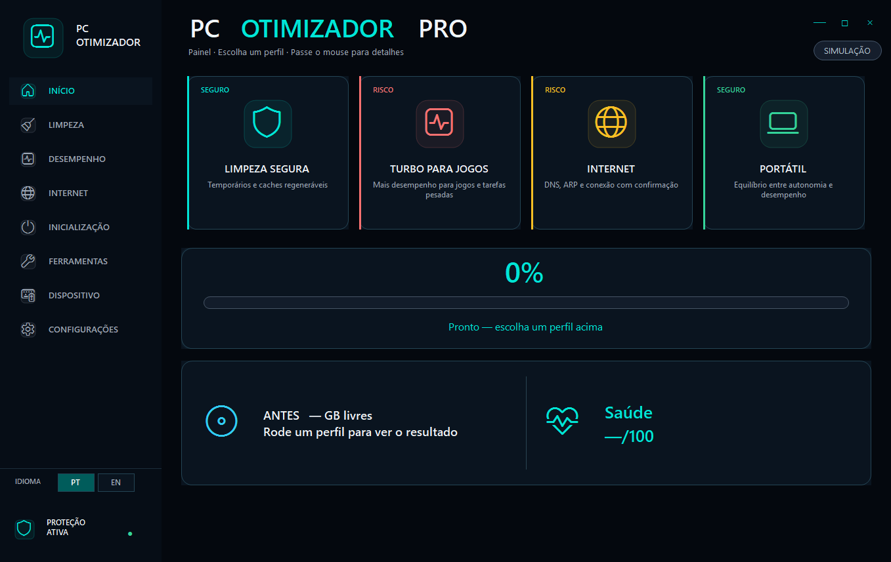

<p align="center">
  
</p>

<p align="center">
  
  
  
  
  
  
</p>

<h1 align="center">◈ PC Otimizador Pro</h1>

<p align="center">
  <b>Limpeza e otimização segura — monorepo multiplataforma</b><br>
  Windows · Linux · macOS · Android (Termux) · iOS (só documentação honesta)<br>
  <i>Não apaga Documentos, Fotos, Downloads, Desktop, favoritos ou senhas.</i>
</p>

---

## Arquitetura

Um **core** de política + um **adapter por SO**. Não existe um único `.bat`/`.ps1` para todos os sistemas.

```text
core/          presets + SECURITY (compartilhado)
Engine.ps1     Windows (maduro)
linux/         Bash CLI
macos/         Bash CLI
android/       Termux (sandbox honesto)
ios/           README — sem limpador de sistema
```

Detalhes: [`core/README.md`](core/README.md) · [`core/SECURITY.md`](core/SECURITY.md)

---

## Comece rápido

### Windows (recomendado)

1. **[Download ZIP](https://github.com/leonardolauriquer/PC-Otimizador/archive/refs/heads/main.zip)** (ou Releases)
2. Extraia → **`Executar.bat`** → UAC
3. Digite **`1`** (Limpeza Segura) → **`E`**  
   Ou **`D`** = dry-run · **`H`** = Health Score

> Anti-AV: use **`Executar.bat`**. O `.exe` é GUI C# nativa (sem ps2exe).

### Linux

```bash
cd linux && chmod +x pc-otimizador.sh && ./pc-otimizador.sh
# ./pc-otimizador.sh --preset safe --yes
```

### macOS

```bash
cd macos && chmod +x pc-otimizador.sh && ./pc-otimizador.sh
# ./pc-otimizador.sh --preset safe --yes
```

### Android (Termux)

```bash
cd android && chmod +x termux-pc-otimizador.sh && ./termux-pc-otimizador.sh
```

Só limpa o ambiente Termux — **não** o telefone inteiro. Ver [`android/README.md`](android/README.md).

### iOS

Sem otimizador de sistema legítimo. Ver [`ios/README.md`](ios/README.md).

---

## Novidades v5 / v5.2

| Recurso | Descrição |
|---------|-----------|
| **Progresso ao vivo** | Barra + etapa na GUI C# (`##PROGRESS##`) |
| **Cancelar** | Botão / flag em `%TEMP%` |
| **Health Score** | 0–100 (disco, RAM, lixo) |
| **Whitelist** | Pastas pessoais + extras |
| **SSD / HDD** | Detecta mídia; avisa Prefetch em SSD |
| **Bloatware** | AppX só com confirmação |
| **Linux / macOS / Termux** | Adapters Bash + `core/presets.json` |
| **Release ZIP** | Actions em tags `v*` |

---

## Menu Windows (`Executar.bat`)

```text
1 Limpeza Segura ★   2 Gamer   3 Internet   4 Completo   5 Notebook
6 Personalizar       7 Varrer+Health   8 Dry-run   9 Agendar
R Remover agenda     H Health   W Whitelist   B Bloat   G GUI   0 Sair
```

---

## Arquivos

| Caminho | Função |
|---------|--------|
| `Executar.bat` | Entrada Windows |
| `Engine.ps1` | Motor Windows v5 |
| `PC-Otimizador-CLI.ps1` | Menus terminal |
| `GuiNative.cs` → `PC-Otimizador.exe` | GUI progresso/cancel |
| `core/` | Presets + política |
| `linux/pc-otimizador.sh` | CLI Linux |
| `macos/pc-otimizador.sh` | CLI macOS |
| `android/termux-pc-otimizador.sh` | Termux |
| `ios/README.md` | Escopo iOS |
| `Tests/Engine.Tests.ps1` | Testes Windows |

**Whitelist (Windows):** `Documentos\PC-Otimizador-Logs\whitelist.txt`  
**Logs (Windows):** `Documentos\PC-Otimizador-Logs\sessao-*.txt`

---

## Segurança

- Whitelist: Documentos, Fotos, Vídeos, Desktop, Downloads  
- Dry-run e estimativa antes de limpar  
- Mobile: só sandbox permitido (Termux / docs iOS)  
- Authenticode: opcional — use `.bat` se o AV reclamar  

---

## Testes / Build / Release

```powershell
powershell -ExecutionPolicy Bypass -File .\Tests\Engine.Tests.ps1
powershell -ExecutionPolicy Bypass -File .\Compilar-EXE.ps1
```

```bash
git tag v5.2.0
git push origin v5.2.0
# Actions gera PC-Otimizador-Windows.zip (inclui linux/macos/android/core)
```

---

## Licença

[MIT](LICENSE)
